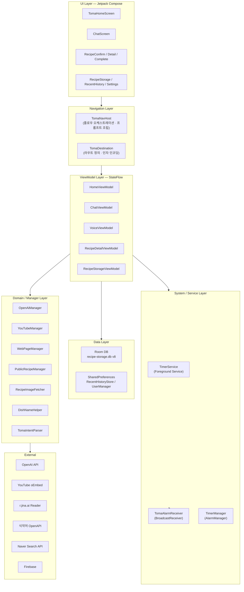
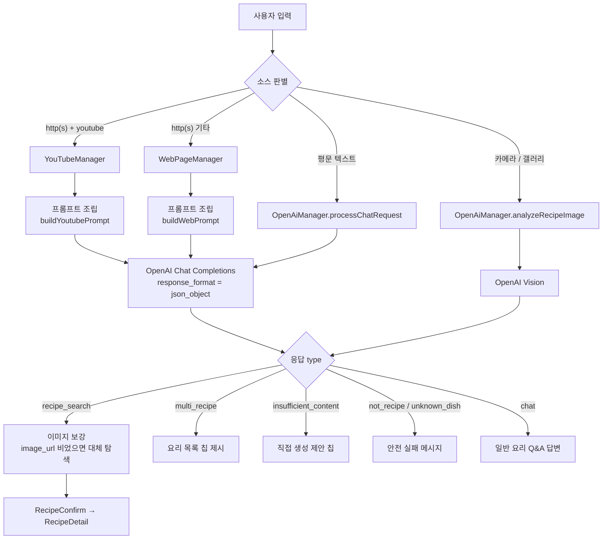
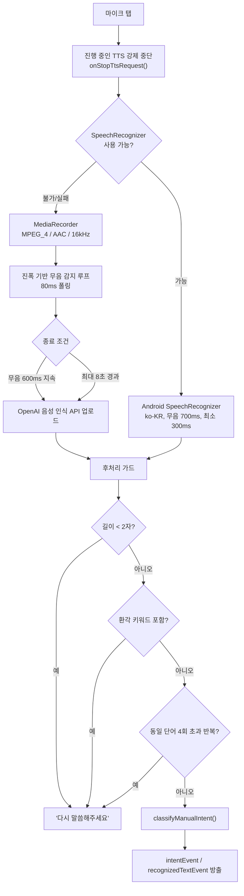
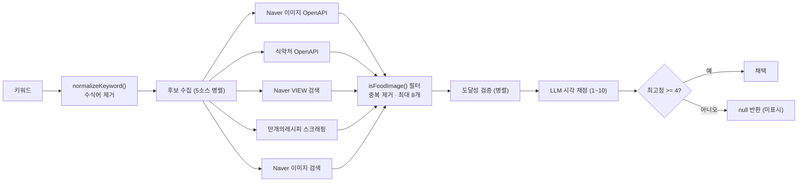

# Toma (토마) — AI 기반 멀티모달 요리 어시스턴트

> 텍스트 · 음성 · 사진 · 유튜브 · 웹 링크 등 이종(異種) 입력을 단일한 **구조화 레시피 스키마**로 정규화하고,
> 조리 중에는 TTS 낭독과 음성 명령으로 **핸즈프리 조리 가이드**를 제공하는 Android 애플리케이션.

| 항목 | 내용 |
|---|---|
| 프로젝트명 | Toma (토마) |
| 패키지 | `com.capstone.toma` |
| 플랫폼 | Android (minSdk 24, targetSdk / compileSdk 36) |
| 언어 | Kotlin 2.2.10 (100%) |
| UI | Jetpack Compose + Material 3 |
| 저장소 | https://github.com/dyyeon/Toma |
| 문서 버전 기준 | `main` @ `4084983` |

---

## 목차

1. [프로젝트 배경 및 문제 정의](#1-프로젝트-배경-및-문제-정의)
2. [프로젝트 목표 및 범위](#2-프로젝트-목표-및-범위)
3. [시스템 아키텍처](#3-시스템-아키텍처)
4. [핵심 설계 상세](#4-핵심-설계-상세)
5. [데이터 모델](#5-데이터-모델)
6. [화면 구성 및 내비게이션](#6-화면-구성-및-내비게이션)
7. [신뢰성 및 예외 처리 전략](#7-신뢰성-및-예외-처리-전략)
8. [기술 스택](#8-기술-스택)
9. [빌드 및 실행](#9-빌드-및-실행)
10. [보안 및 개인정보](#10-보안-및-개인정보)
11. [현재 한계 및 향후 과제](#11-현재-한계-및-향후-과제)
12. [부록](#12-부록)

---

## 1. 프로젝트 배경 및 문제 정의

### 1.1 배경

요리 정보는 현재 **유튜브 영상, 블로그 포스트, 레시피 전문 사이트, 지인이 보내준 사진, 요리책 페이지** 등
서로 다른 매체에 파편화되어 있다. 사용자는 각 매체를 직접 열어 필요한 정보를 스스로 재구성해야 하며,
조리를 시작한 뒤에는 **양손이 젖거나 더러워진 상태**에서 화면을 조작해야 하는 물리적 제약에 부딪힌다.

### 1.2 문제 정의

본 프로젝트가 해결 대상으로 삼은 문제는 다음 네 가지다.

| # | 문제 | 구체적 양상 |
|---|---|---|
| **P1** | **입력 매체의 이질성** | 유튜브는 자막·설명, 블로그는 HTML 본문, 사진은 픽셀, 채팅은 자연어. 각각 추출 방식이 전혀 다르다. |
| **P2** | **조리 중 상호작용 단절** | 손이 자유롭지 않은 상태에서 "다음 단계", "타이머 3분" 같은 조작이 필요하다. |
| **P3** | **LLM 응답의 신뢰성** | 존재하지 않는 요리명에 대해 그럴듯한 레시피를 지어내거나(환각), 원문에 없는 조리 시간을 임의로 삽입해 **실제 요리를 망칠 수 있다.** |
| **P4** | **레시피-이미지 불일치** | "토마토 라멘"을 검색했는데 "토마토 파스타" 사진이 붙는 등, 시각 정보가 레시피와 어긋난다. |

### 1.3 문제의 난이도

- **P1**은 단순 API 호출로 해결되지 않는다. 유튜브는 공식 Data API 키 없이 메타데이터를 얻어야 하고,
  네이버 블로그는 본문이 iframe 안에 있어 일반 크롤링으로는 빈 문서를 반환한다.
- **P3**은 LLM을 쓰는 이상 완전 제거가 불가능하며, **프롬프트 설계 + 후처리 검증 + 안전 실패(safe-fail) 경로**의
  다층 방어가 필요하다. 특히 조리 시간은 잘못 추정하면 음식이 타거나 설익는 **물리적 피해**로 직결된다.

---

## 2. 프로젝트 목표 및 범위

### 2.1 목표

| 목표 | 대응 문제 | 달성 방식 |
|---|---|---|
| **G1. 이종 입력의 단일 스키마 정규화** | P1 | 소스별 전용 수집기 5종 → 공통 `recipe_data` JSON 스키마로 수렴 |
| **G2. 핸즈프리 조리 인터페이스** | P2 | TTS 자동 낭독 + STT 음성 명령 + 단계별 타이머 |
| **G3. 환각 억제 및 안전 실패** | P3 | 응답 타입 4종 분기(`recipe_search` / `chat` / `not_recipe` / `unknown_dish`), 시간 추정 금지 규칙 |
| **G4. 이미지-레시피 정합성 확보** | P4 | 다중 소스 후보 수집 → 도달성 검증 → LLM 시각 채점 → 임계값 미달 시 미표시 |

### 2.2 범위

**포함**
- Android 단일 클라이언트 애플리케이션 (별도 서버 백엔드 없음)
- OpenAI API 직접 호출, 로컬 Room DB 영속화
- 한국어 전용 (모든 LLM 출력 필드는 한국어 강제)

**제외**
- 사용자 계정 시스템 / 서버 동기화 (기기 로컬 저장만)
- 실시간 음성 대화(Realtime API) — 모델 상수는 정의되어 있으나 현재 미연결
- 화자 인식 / 웨이크워드 — Vosk·ONNX Runtime 의존성은 제거됨 (`UserManager`에 잔여 플래그만 존재)

---

## 3. 시스템 아키텍처

### 3.1 계층 구조

MVVM 기반의 **단일 Activity + Compose Navigation** 구조를 채택했다.
DI 프레임워크를 도입하지 않고, 각 Manager는 사용처에서 직접 생성하며
Repository·Database는 `companion object` 기반 이중 검사 잠금(double-checked locking) 싱글턴으로 관리한다.



### 3.2 설계 원칙

| 원칙 | 적용 내용 |
|---|---|
| **단방향 데이터 흐름** | ViewModel이 `StateFlow`로 상태를 노출하고, Composable은 이벤트를 콜백으로 올려보낸다. |
| **일회성 이벤트 분리** | 음성 인식 결과·인텐트는 `SharedFlow`(`recognizedTextEvent`, `intentEvent`, `voiceAnnouncement`)로 방출해 재구성 시 중복 소비를 방지한다. |
| **콜백 → 코루틴 브릿지** | OkHttp의 `enqueue` 콜백을 `suspendCancellableCoroutine`으로 감싸 suspend 함수로 노출 (`processChatRequestSuspend`, `analyzeRecipeImageSuspend`, `fetchRawSuspend`). |
| **화면 간 데이터 전달** | 레시피 전체를 `recipeData` JSON 문자열로 직렬화하고 `Uri.encode()` 후 내비게이션 인자로 전달. 별도 공유 저장소 없이 화면 간 결합도를 낮춘다. |
| **병렬 우선** | 독립적인 네트워크 호출은 `async`/`awaitAll`로 병렬 실행하고, 선행 결과가 확정되면 나머지를 `cancel()` 한다. |

### 3.3 패키지 구조

```
com.capstone.toma
├── MainActivity.kt              단일 Activity · 권한 게이트 · SplashScreen 설치
├── TomaApplication.kt           Firebase 초기화
│
├── OpenAiManager.kt             (628줄) LLM 호출 총괄 — 채팅 / 이미지 / STT + 프롬프트 정의
├── OpenAiConfig.kt              모델 ID 상수 (용도별 라우팅 테이블)
├── YouTubeManager.kt            유튜브 메타데이터 · 썸네일 수집
├── WebPageManager.kt            웹 본문 추출 · 이미지 원본 복원 · 이미지 스코어링
├── PublicRecipeManager.kt       식약처 조리식품 레시피 OpenAPI 어댑터
├── RecipeImageFetcher.kt        (398줄) 이미지 후보 수집 → 검증 → LLM 채점
├── DishNameHelper.kt            요리명 오타 교정 · 정규 검색어 결정 · 이미지 정합성 판정
├── TomaIntent.kt                음성 인텐트 정의 + JSON/규칙 이중 파서
│
├── TimerService.kt              Foreground Service 카운트다운 + 진행 알림
├── TimerManager.kt              AlarmManager 정확 알람 예약
├── TomaAlarmReceiver.kt         타이머 종료 시 알람/진동 처리
├── UserManager.kt               SharedPreferences 기반 사용자 플래그
├── VoiceUiState.kt              음성 UI 상태 sealed class
│
├── model/
│   ├── RecipeModels.kt          RecipeSourceType, StoredRecipe, RecentRecipeRecord
│   └── RecipeCategory.kt        카테고리 정규화 (오분류 방지 우선순위 규칙)
├── navigation/
│   ├── TomaDestination.kt       라우트 정의 + 인자 인코딩 헬퍼
│   └── TomaNavHost.kt           (906줄) 전체 플로우 오케스트레이션 · 소스별 프롬프트 조립
├── storage/
│   ├── RecipeStorageDatabase.kt Room DB 정의 + 마이그레이션 6종
│   ├── RecipeStorageDao.kt      / ChatStorageDao.kt
│   ├── RecipeStorageRepository.kt / ChatRepository.kt
│   └── RecentHistoryStore.kt    SharedPreferences 기반 최근 기록
├── ui/
│   ├── screen/                  16개 화면 Composable
│   ├── component/               TopAppBar · Drawer · ActionMenu · LoadingSection
│   ├── theme/                   Color · Theme · Type
│   └── util/ClickExtensions.kt  중복 클릭 방지 핸들러
└── viewmodel/                   Home · Chat · Voice · RecipeDetail · RecipeStorage
```

---

## 4. 핵심 설계 상세

### 4.1 멀티소스 레시피 수집 파이프라인 (G1)

#### 4.1.1 전체 흐름



#### 4.1.2 소스별 수집 전략

**(A) 유튜브 — `YouTubeManager`**

공식 Data API 키 없이 세 가지 정보를 **병렬로** 수집한다.

| 수집 대상 | 방법 | 실패 처리 |
|---|---|---|
| 제목 | `youtube.com/oembed?url=...&format=json` | **성공/실패 판정의 기준(source of truth)**. 실패 시 전체 분석 중단 |
| 설명 | 워치 페이지 HTML의 `og:description` 메타 태그 파싱 (속성 순서 2가지 + `name="description"` 총 3패턴) | best-effort. 실패 시 제목만으로 진행 |
| 썸네일 | `maxresdefault.jpg`에 HEAD 요청 → `Content-Length > 1000` 확인 | 실패 시 항상 존재하는 `hqdefault.jpg`로 폴백 |

- Shorts URL(`/shorts/{id}`)은 `normalizeUrl()`로 `/watch?v={id}` 형태로 변환한다.
- 동의(consent) 페이지나 일반 플레이스홀더(`"Enjoy the videos and music..."`)가 반환되면 설명을 `null` 처리한다.
- 제목에 `N가지`, `주간 밥상`, `밥상 모음` 패턴이 있으면 **다중 레시피 영상**으로 판단하여
  요리 목록을 먼저 추출하고(`multi_recipe`), 사용자가 칩으로 하나를 고르게 한다.

**(B) 웹/블로그 — `WebPageManager`**

- **본문 추출**: `https://r.jina.ai/{url}` 리더 프록시를 경유해 HTML을 마크다운으로 변환받는다.
  앱 내 HTML 파서 유지보수 부담을 제거하기 위한 선택이다.
- **네이버 블로그 iframe 우회**: `blog.naver.com/{id}/{no}` 또는 `PostView.naver?blogId=&logNo=` 패턴을
  정규식으로 추출해 내부 `PostView.naver` URL을 직접 호출한다.
  그래도 본문이 **200자 미만**이면 iframe이 없는 모바일 렌더러(`m.blog.naver.com`)로 재시도하고,
  더 긴 결과를 채택한다.
- **추적 파라미터 제거**: `isInf`, `trackingCode`, `from`, `refer`, `src` 등을 제거해 프록시 캐시 오염을 막는다.
- **이미지 원본 해상도 복원**: CDN별 리사이즈 규칙을 역산한다.

  | CDN | 처리 |
  |---|---|
  | `pstatic.net` (네이버) | `type` 쿼리에 숫자가 있으면 `type=w966`으로 교체 |
  | `ezmember.co.kr` (만개의레시피) | 경로의 `_280X205`, `-280x205c` 형태 접미사 제거 |
  | `daumcdn.net` / `kakaocdn.net` | thumb 프록시의 `fname` 파라미터에서 원본 URL 추출 |
  | `tistory.com` | 경로 선두의 `/R800x0/` 리사이즈 세그먼트 제거 |
  | 그 외 | `w`, `h`, `width`, `height`, `resize`, `size` 쿼리 제거 |

**(C) 이미지 — `OpenAiManager.analyzeRecipeImageSuspend`**

전처리 3-pass 후 Vision 모델에 Base64 인라인 전송한다.

```
Pass 1  inJustDecodeBounds=true 로 크기만 읽어 inSampleSize 계산 (목표 최대 변 1024px)
Pass 2  ExifInterface 로 회전 각도(90/180/270) 판독
Pass 3  다운샘플 디코딩 → 비율 유지 스케일 → 회전 매트릭스 적용 → JPEG 90% 압축 → Base64
```

메모리 절감을 위해 중간 비트맵은 `recycle()` 하며, `detail: "high"`로 요청한다.

**(D) 공공 데이터 — `PublicRecipeManager`**

식약처 식품안전나라 `COOKRCP01` API를 호출해 레시피명·카테고리·열량·영양정보·`MANUAL01~20` 단계를
파싱한다. 주 용도는 **정답 이미지(`ATT_FILE_NO_MAIN`) 확보**이며, 응답 이미지는 `http` → `https`로 승격한다.

---

### 4.2 LLM 연동 설계 (G3)

#### 4.2.1 모델 라우팅

`OpenAiConfig`가 용도별 모델을 상수로 정의하고, `OpenAiManager`가 요청 특성에 따라 동적으로 선택한다.

| 상수 | 모델 | 용도 |
|---|---|---|
| `DEFAULT_TEXT_MODEL` | `gpt-5.4-mini-2026-03-17` | 기본 채팅 · 레시피 분석 |
| `INTENT_MODEL` | `gpt-5.4-nano` | 짧은 음성 인텐트 파싱 |
| `IMAGE_MODEL` | `gpt-5.5` | 이미지 분석 · 이미지 채점 |
| `ADVANCED_MODEL` | `gpt-5.5` | 복합 추론 요청 |
| `STT_MODEL` | `gpt-realtime-whisper` | 음성 인식 |
| `REALTIME_MODEL` | `gpt-realtime-2` | (정의만, 현재 미사용) |

**라우팅 휴리스틱** — 비용과 품질을 균형 잡기 위한 키워드 스코어링:

```kotlin
isComplexRequest(text) =
    constraintScore >= 2 || reasoningScore >= 2 || text.length > 200

constraintScore : "알레르기", "못 먹", "빼고", "없이", "채식", "비건",
                  "글루텐", "분 안에", "오븐 없이", "냉장고에 있는" … 포함 개수
reasoningScore  : "왜", "실패", "분석", "원인", "영양", "칼로리",
                  "다이어트", "대체", "substitut", "improve" … 포함 개수

isIntentRequest(text) =
    text.length < 30 && text 에 {다음, 이전, 시작, 정지, 멈춰, 타이머,
                                재개, 처음, 끝, 완료, 보여줘, 알려줘} 중 하나 포함
```

즉 **제약 조건이 겹치거나 인과 추론이 필요한 요청만** 상위 모델로 승격되고, 짧은 조작 명령은 나노 모델로 내린다.

#### 4.2.2 응답 스키마 계약

모든 호출은 `response_format: { type: "json_object" }`로 강제되며, 응답은 다음 5종 중 하나다.

| `type` | 의미 | 앱의 처리 |
|---|---|---|
| `recipe_search` | 레시피 생성/추출 성공 | `recipe_data` 파싱 → 카테고리 정규화 → 이미지 보강 → 확인 화면 이동 |
| `chat` | 레시피 없이 답할 수 있는 요리 Q&A | 채팅 버블로만 표시 |
| `not_recipe` | 요리와 무관한 입력 | 안내 메시지, 내비게이션 없음 |
| `unknown_dish` | **요리명을 확신할 수 없음 (안전 실패)** | 정확한 이름 재입력 유도 |
| `multi_recipe` / `insufficient_content` | 다중 요리 영상 / 본문 부족 | 선택 칩(quick action) 제시 |

`recipe_data` 스키마:

```jsonc
{
  "title":       "김치볶음밥",
  "category":    "한식",              // 한식/양식/중식/일식/동남아식/디저트/기타
  "ingredients": ["밥 2공기", "김치 1컵", "고추장 1스푼"],
  "steps":       ["1단계 …", "2단계 …"],
  "stepTimes":   [0, 180, 0, 300],    // steps 와 길이 동일, 단위: 초
  "difficulty":  "쉬움",              // 쉬움/보통/어려움
  "time":        18,                  // 총 조리시간, 단위: 분, 정수
  "image_url":   ""
}
```

#### 4.2.3 프롬프트 설계 원칙

시스템 프롬프트(`buildChatSystemPrompt`)는 약 140줄 규모이며 다음 축으로 구성된다.

| 축 | 내용 | 의도 |
|---|---|---|
| **언어 강제** | 모든 값 필드는 한국어. 재료·단계까지 번역, 무번역 시 음차. 숫자·단위·URL만 예외 | 영문 소스 입력 시 혼용 방지 |
| **범위 제한** | 요리·레시피·식재료·주방 기술만. 그 외는 `not_recipe` | 범용 챗봇화 방지 |
| **카테고리 규칙** | 문화적 기원 기준. `마라탕`은 반드시 중식 등 명시적 예외 열거 | 한국어 형태소 오분류 차단 |
| **단계 작성 규칙** | 최소 8단계, **1단계 = 1개의 물리적 동작**. "썰어서 볶는다"는 2단계로 분리 | 음성 낭독 단위 확보 |
| **문체 규칙** | `[연결 문구] + [현재 상태] + [구체적 행동] + [기대 결과/팁]` 구조. 불 세기(강불/중불/약불) 명시 | TTS로 들었을 때 자연스러운 흐름 |
| **조리법별 규칙** | 찌기·끓이기·볶기·졸이기·튀기기 각각의 필수 단계 정의 (예: 튀기기 → 기름 온도 확인법 포함) | 초보자 실패 방지 |
| **안전 검증** | 요리명이 실재한다고 **99% 이상 확신**할 때만 `recipe_search`. 오타 자동 교정 금지, 유사 요리 매핑 금지 | **환각 억제의 핵심 장치** |

이미지 분석 프롬프트에는 추가로 다음이 포함된다.

- **음식 여부 선판정**: 키보드·노트북·풍경·인물 등은 명시적으로 "음식 아님"으로 열거하고,
  식별 불가라는 이유로 레시피를 지어내는 것을 절대 금지한다.
- **유사 요리 시각 판별 규칙**: 갈비찜 / 찜닭 / 장조림 / 갈비탕 / LA갈비 / 소불고기를 뼈·당면·메추리알·국물색으로
  구분하고, 김치찌개 / 된장찌개 / 부대찌개 / 순두부찌개를 색·건더기로 구분한다.
- **저확신 시 처리**: 80% 미만이면 `not_recipe`가 아니라 **서술적 일반명**(예: "간장 베이스 고기 조림")으로
  진행하되, 응답에 확인 요청 문구를 포함시킨다.

#### 4.2.4 조리 시간 환각 억제 (P3의 핵심)

조리 시간 오류는 실제 피해로 이어지므로 **프롬프트 규칙과 클라이언트 파서 양쪽에서** 이중으로 막는다.

**프롬프트 측 규칙**
- `stepTimes`는 `steps`와 **정확히 같은 길이**의 정수 배열(초).
- **원문에 숫자 시간이 명시된 단계만** 0이 아닌 값을 갖는다.
- AI가 새로 생성한 레시피는 시간을 정할 수 있으나, **그 시간을 단계 문장에 반드시 눈에 보이게 써야 한다.**
- `끓이다·볶다·굽다·찌다·튀기다·재우다·삶다` 같은 **조리 동사만 보고 기본값(예: 3분)을 넣는 것을 금지**한다.

**클라이언트 측 파서** — `resolveStepTimerSeconds()`

```
1) stepTimes[stepIndex-1] 이 존재하고 > 0  →  그 값 사용 (초)
2) 없으면 단계 문장에서 명시적 시간 표현만 정규식 추출
     (\d+)\s*[~-]\s*(\d+)\s*분   범위 → 상한값 채택 ("15~20분" → 20분)
     (\d+)\s*분
     (\d+)\s*초
3) 그래도 없으면 0  →  해당 단계에는 타이머를 제공하지 않음
```

또한 GPT가 `stepTimes`를 `steps`보다 짧게 반환하는 경우를 대비해
**부족분을 0으로 패딩**하여 인덱스 어긋남을 방지한다.

총 조리시간(`time`) 표기는 `stepTimes` 합계를 분 단위로 올림(`ceil`)한 값을 우선하고,
합이 0이면 모델이 준 `time` 필드를 `parseTimeDisplay()`로 파싱한다.
이 파서는 정수(`"35"`), `"1시간 20분"`, `"30분"`, 혼합 문자열까지 4단계로 폴백한다.

---

### 4.3 음성 인터랙션 설계 (G2)

#### 4.3.1 STT 이중화 구조



**설계 근거**

| 요소 | 값 | 근거 |
|---|---|---|
| VAD 진폭 임계값 | `200` | 주방 환경 배경 소음과 발화를 가르는 실측 기준선 |
| 무음 타임아웃 | `600ms` | 짧은 명령("다음")의 응답성과 문장 중간 끊김 사이의 절충 |
| 최대 녹음 길이 | `8000ms` | 명령 발화 상한. 초과 시 강제 종료로 무한 녹음 방지 |
| 최소 유효 길이 | `500ms` + 최대 진폭 `200` 이상 | 오터치로 인한 빈 녹음 업로드 차단 |
| 첫 폴링 무시 | `firstPoll` 스킵 | `MediaRecorder.maxAmplitude` 첫 호출값이 항상 0인 특성 보정 |

**환각 필터** — 음성 인식 모델이 무음 구간에서 학습 데이터의 상투구를 출력하는 현상에 대응한다.
차단 목록: `자막`, `구독`, `좋아요`, `시청해주셔서`, `알림설정`, `영상`, `채널`, `댓글`,
`subscribe`, `thanks for watching`, `notification` 등.

**반복 필터** — 동일 단어가 4회를 초과해 등장하면(4단어 이상 문장 한정) 디코딩 루프로 간주하고 폐기한다.

#### 4.3.2 인텐트 분류

두 개의 독립 경로가 존재한다.

| 경로 | 위치 | 방식 |
|---|---|---|
| **LLM 경로** | `TomaIntentParser.parse()` | 응답 JSON의 `intent` 필드를 우선 사용. 파싱 실패 시 `fallbackParse()`로 규칙 기반 전환 |
| **직접 경로** | `VoiceViewModel.classifyManualIntent()` | 네트워크 왕복 없이 로컬 문자열 매칭으로 즉시 분류 (조리 중 응답성 확보) |

인텐트 종류: `NEXT_STEP`, `PREVIOUS_STEP`, `REPEAT_STEP`, `SET_TIMER(min)`, `RECOMMENDED_TIMER`,
`START_TIMER`, `CANCEL_TIMER`, `RECIPE_SEARCH(keyword)`, `INGREDIENT_CHECK`, `HELP`, `CANCEL`, `UNKNOWN`.

`fallbackParse()`의 판정 순서는 **오분류 비용이 큰 것부터** 배치된다.

```
1. 추천 타이머   "추천으로", ("추천" + "타이머"/"시간"), 숫자 없는 "타이머"
2. 타이머 취소   ("타이머"/"알람") + (취소·꺼줘·중지·멈춰·그만·stop)
3. 시간 설정     (\d+)분 + (타이머·맞춰·설정·시작·재줘·알람·켜줘 …)
4. 단계 이동     다음/넘겨 · 이전/뒤로 · 다시/반복
5. 숫자만 존재   → 요리 맥락이므로 SET_TIMER 로 간주
6. 기타          "재료" → INGREDIENT_CHECK, "취소"/"그만" → CANCEL
```

#### 4.3.3 TTS와 STT의 상호배제

TTS 출력이 마이크로 되돌아 들어가는 **자기 음성 인식(self-echo)** 문제를 다음으로 차단한다.

- `VoiceViewModel.isTtsSpeaking`을 `@Volatile`로 선언해 서로 다른 스레드에서 즉시 관측 가능하게 한다.
- 화면(`RecipeDetailScreen`)이 `voiceViewModel.onStopTtsRequest` 콜백을 등록하고,
  마이크가 켜지는 순간 ViewModel이 이를 호출해 **TTS를 하드 정지**시킨다.
- `UtteranceProgressListener`의 `onStart / onDone / onError / onStop` 전부에서 플래그를 갱신한다.
- `LaunchedEffect(voiceUiState)`가 `Listening` 진입과 `isTtsSpeaking`이 겹치는 순간을 감지해 추가 방어한다.
- 동일 `key`로 재요청된 발화는 `lastSpokenKey` 비교로 스킵해 중복 낭독을 막는다.
- `Lifecycle.Event.ON_PAUSE`에서 TTS 정지 + `onAppBackground()` 호출로 백그라운드 마이크 점유를 해제한다.

#### 4.3.4 이중 타이머 구조

용도가 다른 두 개의 타이머가 독립적으로 존재한다.

| 구분 | `TimerService` | `RecipeDetailViewModel` |
|---|---|---|
| 성격 | Foreground Service (프로세스 수준) | 화면 스코프 코루틴 |
| 제어 주체 | `VoiceViewModel` | `RecipeDetailScreen` |
| 상태 | `remainingSeconds`, `isTimerRunning` | `StepTimerState { IDLE, RUNNING, PAUSED, FINISHED }` |
| 알림 | `NotificationCompat` 진행 알림 + 종료 시 `TomaAlarmReceiver` 브로드캐스트 | 화면 내 타이머 카드 |
| 목적 | 화면이 꺼져도 유지되는 조리 타이머 | 단계별 권장 시간의 시각적 카운트다운 |
| 조정 범위 | 분 단위 재시작 | `adjustDuration()` — 30초 ~ 3600초로 클램프 |

`TimerService`는 `bindService(BIND_AUTO_CREATE)`로 바인딩되어 `StateFlow`를 직접 구독하며,
동시에 `startForegroundService` + `action`(`START`/`STOP`) 방식으로도 제어된다.
`foregroundServiceType`은 `specialUse`로 선언되어 있다.

**단계 이동 시 타이머 정합성** — `onStepChanged(newIndex)`에서 타이머가 시작된 단계(`timerStartedAtStep`)와
현재 단계가 다르면 타이머를 취소하고 `voiceAnnouncement`로 "이전 단계 타이머를 종료했어요"를 음성 고지한다.

---

### 4.4 이미지 획득 및 정합성 검증 (G4)

`RecipeImageFetcher`는 3단계 파이프라인으로 동작한다.



**1) 키워드 정규화** — 이미지 검색을 방해하는 수식어 약 50개를 제거한다.
`빨간`, `매콤한`, `할머니표`, `백종원`, `초간단`, `끝판왕`, `찐` 등.
`"할머니표 매콤한 제육볶음"` → `"제육볶음"`.

**2) 도달성 검증** — 죽은 링크와 위장 리소스를 걸러낸다.

```
HEAD 요청
 ├ 405 / 501 (HEAD 미지원)      → null → Range GET 폴백
 ├ 2xx + Content-Type: image/*  → true
 ├ 2xx + Content-Type 없음      → null → Range GET 폴백
 └ 그 외                        → false

Range GET (bytes=0-1023)
 ├ Content-Type: image/*        → true
 └ 불명확 → 선두 8바이트 매직넘버 검사
      JPEG FF D8 FF · PNG 89 50 4E 47 · WebP RIFF · GIF 47 49 46
```

**3) LLM 시각 채점** — 후보 이미지를 Vision 모델에 보내 1~10점으로 평가시킨다.
채점 프롬프트는 **"이름이 비슷하거나 재료가 겹쳐도 다른 요리면 반드시 낮게"** 를 명시하며,
비용 절감을 위해 `detail: "low"`, `max_completion_tokens: 200`을 사용한다.

| 상수 | 값 | 의미 |
|---|---|---|
| `MAX_CANDIDATES` | 8 | 채점 비용 상한 |
| `MIN_ACCEPTABLE_SCORE` | 4 | 미달 시 **이미지를 붙이지 않는다** |
| `DEFAULT_SCORE_NO_API` | 7 | API 키 없음/호출 실패 시 중립 점수 |

> **설계 판단**: 잘못된 이미지를 보여주는 것보다 **아무 이미지도 안 보여주는 편이 낫다**는 원칙을 적용해,
> 임계값 미달 시 `null`을 반환한다. `WebPageManager.pickRecipeImage()`도 같은 원칙으로
> alt 일치 `+100`, 주변 ±250자 텍스트 일치 `+60`, `cache/recipe` URL 패턴 `+30`을 합산해
> **60점 미만이면 반환하지 않는다.**

**이미지 보강 전략** — 채팅 응답에 `image_url`이 비어 있으면 다음을 병렬 실행한다.

```kotlin
val publicDeferred = async { PublicRecipeManager().searchRecipe(searchKeyword) }
val webDeferred    = async { WebPageManager().searchFoodImage(searchKeyword) }
// 공공 API 결과가 DishNameHelper.isImageConsistentWithRecipe() 를 통과하면
// 웹 검색을 즉시 cancel() 하고 그 결과를 채택
```

---

### 4.5 한국어 도메인 보정

#### 4.5.1 카테고리 정규화 — `normalizeRecipeCategory()`

한국어 요리명은 부분 문자열 매칭 시 오분류가 빈번하다.
대표 사례가 **"마라탕"의 `탕` → 한식 오분류**다. 이를 3단계 우선순위로 해결한다.

```
0순위  titleCorrectionMap 하드코딩 오버라이드
       마라탕·마라샹궈·짜장면·짬뽕·탕수육·훠궈 → 중식
       초밥·사시미·라멘·우동·돈카츠           → 일식
       피자·파스타·스테이크·햄버거            → 양식
       팟타이·쌀국수                          → 동남아식

1순위  한식 키워드   (한국어 서비스 특성상 최우선)
2순위  디저트 → 일식 → 중식 → 양식 → 동남아식
3순위  rawCategory 가 유효 값이면 그대로, 아니면 "기타"
```

#### 4.5.2 요리명 오타 교정 — `DishNameHelper`

STT 오인식과 사용자 오타를 **LLM 전송 전에** 교정한다.
오인식 위험이 낮은 명확한 케이스만 매핑에 포함한다(`팔보재`→`팔보채`, `복음밥`→`볶음밥`,
`재육볶음`→`제육볶음`, `낚지볶음`→`낙지볶음` 등).

이 헬퍼는 세 가지 역할을 담당한다.

| 함수 | 역할 |
|---|---|
| `correctDishNameInText()` | 채팅 전송 직전 오타 교정 |
| `canonicalSearchKeyword()` | GPT 키워드와 레시피 제목 중 이미지 검색에 적합한 정규 키워드 결정 |
| `isImageConsistentWithRecipe()` | 공공 API가 반환한 요리명이 검색어와 충분히 일치하는지 판정 |

---

## 5. 데이터 모델

### 5.1 Room 스키마 — `recipe-storage.db` (version 8)

| 테이블 | 엔티티 | 주요 컬럼 | 용도 |
|---|---|---|---|
| `stored_recipes` | `StoredRecipeEntity` | id(PK), title, category, story, time, difficulty, servings, calories, rating, favorite, ingredients, steps, sourceType, timeText, imageUri, updatedAt | 사용자가 저장한 레시피 |
| `recent_recipe_history` | `RecentRecipeHistoryEntity` | id(PK), title, timeText, sourceType, recipeDataJson, updatedAt | 최근 조회 (5개 유지) |
| `chat_sessions` | `ChatSessionEntity` | id(PK), title, createdAt, lastUpdatedAt | 채팅 세션 |
| `chat_messages` | `ChatMessageEntity` | id(PK), sessionId, text, isUser, timestamp, imageUri, orderIndex, recipeContextJson | 채팅 메시지 |

**TypeConverter** — `List<String>`은 `JSONArray` 문자열로, `RecipeSourceType`은 `enum.name`으로 직렬화한다.
역변환은 `runCatching { valueOf() }.getOrDefault(TEXT)`로 알 수 없는 값에 대해 안전하게 폴백한다.

### 5.2 마이그레이션 이력

| 버전 | 내용 |
|---|---|
| 2 → 3 | `stored_recipes.imageUri` 컬럼 추가 |
| 3 → 4 | `recent_recipe_history` 테이블 신설 |
| 4 → 5 | 동일 이름이 **view로 생성된 기기**가 존재해, `sqlite_master.type`을 조회해 view/table을 구분 후 DROP → 재생성 |
| 5 → 6 | `sourceType` 오분류 데이터 정정. `imageUri`가 youtube 도메인이면 `YOUTUBE`, `http`로 시작하면 `WEB`으로 재라벨링 (카메라 촬영본은 `content://`라 보존됨) |
| 6 → 7 | `chat_sessions` / `chat_messages` 테이블 신설 |
| 7 → 8 | `chat_messages.recipeContextJson` 컬럼 추가 |

최종 안전망으로 `fallbackToDestructiveMigration(dropAllTables = true)`가 설정되어 있다.

> **주목할 설계**: 4→5와 5→6은 단순 스키마 변경이 아니라 **이미 배포된 잘못된 데이터를 SQL로 교정**하는
> 데이터 마이그레이션이다. 특히 5→6은 `inferSourceType`이 "빈 문자열이 아닌 `image_url`"을 모두 `IMAGE`로
> 판정하던 버그의 사후 보정이다.

### 5.3 이중 최근 기록 저장소

현재 최근 기록은 **두 곳**에 존재한다.

| 저장소 | 위치 | 최대 개수 | 사용처 |
|---|---|---|---|
| `RecentHistoryStore` | SharedPreferences (`recent_history_store`) | 20 | `HomeViewModel` — 홈 화면 표시 |
| `recent_recipe_history` | Room | 5 (`trimRecentRecipes`) | `RecipeStorageRepository` |

`HomeViewModel.clearRecentHistory()`는 양쪽을 모두 비운다.
(→ [11. 향후 과제](#11-현재-한계-및-향후-과제) 참조)

**레코드 ID 생성** — 같은 제목이라도 재료·단계·이미지가 다르면 별개 레시피로 취급해야 하므로
콘텐츠 해시를 결합한다.

```kotlin
base        = "${title.lowercase()}_${sourceType.name}"
contentHash = (ingredients + steps + imageUrl).hashCode()
id          = "${base}_$contentHash".hashCode().toUInt().toString()
```

### 5.4 화면 간 데이터 전달

별도 공유 저장소를 두지 않고, 레시피 JSON을 내비게이션 인자로 직접 전달한다.

```
recipe_detail/{keyword}/{sourceType}?recipeData={recipeData}
                ↑           ↑                      ↑
          Uri.encode    enum.name          Uri.encode(JSON 전문)
```

`RecipeSourceType`은 `TEXT`, `YOUTUBE`, `WEB`, `IMAGE`, `SAVED` 5종이며,
역변환 실패 시 `TEXT`로 폴백한다.

---

## 6. 화면 구성 및 내비게이션

### 6.1 화면 목록

| 라우트 | 화면 | 역할 |
|---|---|---|
| `home` | `TomaHomeScreen` | 검색바 · 유튜브 링크 입력 · 사진 스캔 · 최근 기록 |
| `ai_chat` | `ChatScreen` | AI 대화, 분석 진행 상태 실시간 표시, 선택 칩 |
| `chat_history` | `SessionListScreen` | 채팅 세션 목록 |
| `voice_guide` | `VoiceGuideScreen` | 음성 입력 전용 화면 + 추천 발화 예시 |
| `recipe_confirm/...` | `RecipeConfirmScreen` | 조리 시작 전 재료·단계 확인 |
| `recipe_detail/...` | `RecipeDetailScreen` | **조리 모드** — TTS 낭독 · 음성 명령 · 단계 타이머 |
| `recipe_detail_storage/...` | `RecipeDetailScreen(fromStorage=true)` | 보관함에서 진입한 조리 모드 |
| `recipe_complete/...` | `RecipeCompleteScreen` | 완료 화면 |
| `recipe_storage` | `RecipeStorageScreen` | 보관함 (카테고리 필터 · 즐겨찾기) |
| `recent_history` | `RecentHistoryScreen` | 최근 분석 전체 목록 |
| `settings_main` 외 5종 | Settings / Push / Email / CustomerCenter / ContactUs / PrivacyPolicy | 설정 및 정책 |

### 6.2 진입점별 흐름

| 진입점 | 처리 |
|---|---|
| 홈 검색바에 **URL** 입력 | `launchLinkAnalysis()` → 채팅 화면으로 이동하며 분석 진행 |
| 홈 검색바에 **평문** 입력 | `resetChat()` → `sendMessage()` → 채팅 |
| 유튜브 링크 입력창 | URL 유효성 검사 후 `launchLinkAnalysis()` |
| 사진 스캔 버튼 | 바텀시트 → 카메라(권한 확인 → `FileProvider` URI) 또는 갤러리(`GetContent`) |
| 마이크 버튼 | `voice_guide` → 인식 결과를 채팅으로 전달 후 `popUpTo(inclusive)` |
| 보관함 → 조리 시작 | `SAVED` 소스로 최근 기록 저장 후 `recipe_detail_storage`로 이동 |

**호스트별 진행 메시지** — 분석 대기 중 사용자 불안을 줄이기 위해 URL 호스트에 따라 문구를 다르게 표시한다.
(`네이버 블로그 레시피 분석 중입니다...`, `만개의레시피에서 레시피를 가져오는 중입니다...`,
`유튜브 쇼츠에서 레시피를 찾고 있습니다...` 등)

---

## 7. 신뢰성 및 예외 처리 전략

### 7.1 실패 지점별 대응

| 실패 지점 | 감지 | 대응 |
|---|---|---|
| API 키 미설정 | `apiKey.isBlank()` | 즉시 명시적 에러 반환. 무한 대기 없음 |
| 네트워크 오류 | `onFailure(IOException)` | `VoiceRequestResult.Error`로 변환 후 다이얼로그 표시 |
| API 오류 응답 | `parseApiError()` | 응답 본문의 `error.message` 추출, 실패 시 HTTP 코드 표기 |
| JSON 파싱 실패 | `try/catch` | "응답 파싱 실패" 메시지 |
| 링크 로드 실패 | `fetchFailed` 복합 판정 | "링크를 읽어올 수 없어요" + 직접 입력 유도 |
| 본문 부족 | `insufficient_content` | 요리명 기반 직접 생성 제안 칩 |
| 요리명 불확실 | `unknown_dish` | 재입력 유도 (**추측 금지**) |
| 비요리 콘텐츠 | `not_recipe` | 안내 후 내비게이션 차단 |
| 음성 인식 실패 | 3중 가드 | "다시 말씀해주세요" → 1초 후 `forceResetToIdle()` |
| 이미지 부적합 | 점수 임계값 | 이미지 미표시 (잘못된 이미지보다 우선) |
| SpeechRecognizer 미지원 | `isRecognitionAvailable()` | MediaRecorder + 서버 STT로 자동 전환 |
| 권한 거부 | 런타임 체크 | 카메라: 에러 다이얼로그 / 알림: 설정 화면 이동 안내 |

### 7.2 동시성 및 상태 정합성

| 문제 | 해결 |
|---|---|
| 이전 요청 콜백이 뒤늦게 도착해 새 대화를 오염 | `requestGeneration` 카운터. `resetChat()` 시 증가시키고, 콜백에서 세대가 다르면 폐기 |
| 링크 분석 중 화면 전환 | `linkAnalysisJob?.cancel()`로 진행 중 코루틴 취소 |
| `suspendCancellableCoroutine` 중복 resume | 모든 resume 지점에서 `continuation.isActive` 확인 |
| Composable 클로저의 stale 값 캡처 | `rememberUpdatedState`로 최신 값 참조 (`isTimerRecommendedState`) |
| 중복 클릭으로 인한 이중 내비게이션 | `rememberMultipleClickHandler()`로 클릭 처리 |
| TTS 중복 발화 | `lastSpokenKey` 비교 후 스킵 |
| Service 바인딩 누수 | `onCleared()`에서 `unbindService` + `speechRecognizer.destroy()` |

### 7.3 리소스 관리

- 모든 OkHttp 응답은 `response.use { }`로 감싸 커넥션 누수를 방지한다.
- `OkHttpClient`는 용도별 타임아웃을 분리한다.

  | 클라이언트 | connect | read | write |
  |---|---|---|---|
  | `OpenAiManager` | 30s | 60s | 60s |
  | `WebPageManager` | 20s | 30s | — |
  | `PublicRecipeManager` | 15s | 20s | — |
  | `RecipeImageFetcher` | 10s | 15s | — |

- 비트맵은 사용 후 `recycle()` 하며, 스케일 결과가 원본과 동일 객체인 경우를 검사해 이중 해제를 막는다.
- 카메라 촬영이 취소되면 생성해 둔 임시 파일을 즉시 삭제한다.

---

## 8. 기술 스택

### 8.1 스택 요약

| 분류 | 항목 |
|---|---|
| **언어 · UI** | Kotlin 2.2.10 · Jetpack Compose (BOM 2024.09.00) · Material 3 · material-icons-extended · Compose Navigation 2.9.7 · Core SplashScreen 1.0.1 |
| **아키텍처** | MVVM · AndroidViewModel · StateFlow / SharedFlow · Kotlin Coroutines · Repository 패턴 · Sealed class 상태 모델 |
| **로컬 데이터** | Room 2.7.2 (+ KSP 2.3.6) · SharedPreferences · JSON TypeConverter |
| **네트워크** | OkHttp 4.12.0 · Gson 2.10.1 · org.json |
| **이미지** | Coil 2.7.0 · BitmapFactory · ExifInterface |
| **AI / LLM** | OpenAI Chat Completions (JSON mode) · Vision · Audio Transcriptions |
| **음성 · 시스템** | SpeechRecognizer · TextToSpeech · MediaRecorder · ToneGenerator · Foreground Service · Bound Service · AlarmManager · BroadcastReceiver · NotificationCompat · FileProvider |
| **외부 서비스** | Firebase BoM 33.9.0 (App · Storage · coroutines-play-services) · 식약처 식품안전나라 OpenAPI · YouTube oEmbed · r.jina.ai Reader · Naver 검색 OpenAPI |
| **빌드** | AGP 9.1.1 · Gradle 9.3.1 (Kotlin DSL) · Version Catalog · BuildConfig 주입 · google-services 4.4.2 · Java 11 |
| **테스트** | JUnit 4.13.2 · AndroidX Test 1.3.0 · Espresso 3.7.0 · Compose UI Test (JUnit4) |

### 8.2 제거된 의존성 (설계 변경 이력)

| 의존성 | 제거 사유 |
|---|---|
| `com.microsoft.onnxruntime:onnxruntime-android` | 웨이크워드(wakeword) 기능 제거로 미사용 |
| `com.alphacephei:vosk-android` | 온디바이스 STT 폐기, 서버 STT로 전환 |
| `net.java.dev.jna:jna` | Vosk 제거에 따른 연쇄 제거 (`libjnidispatch.so` 원인) |

`androidx.graphics:graphics-path:1.0.1`은 **16KB 페이지 크기 정렬** 대응을 위해 버전을 명시적으로 고정한다.

---

## 9. 빌드 및 실행

### 9.1 요구 사항

- Android Studio (AGP 9.1.1 지원 버전)
- JDK 11 이상
- Android SDK 36
- 실기기 권장 (마이크 · 카메라 · TTS 사용)

### 9.2 API 키 설정

루트의 `local.properties`에 추가한다. 이 파일은 `.gitignore` 대상이므로 커밋되지 않는다.

```properties
sdk.dir=<Android SDK 경로>

OPENAI_API_KEY=sk-...
FOOD_SAFETY_API_KEY=...      # 식약처 식품안전나라 OpenAPI (필수: 공공 레시피/이미지)
NAVER_CLIENT_ID=...          # 선택: 이미지 후보 확대
NAVER_CLIENT_SECRET=...      # 선택
```

**키 해석 순서** (`app/build.gradle.kts`)

```
1) local.properties
2) 환경 변수 (System.getenv)
3) OPENAI_API_KEY 한정: 공유 프로퍼티 파일 경로 후보 순차 탐색
4) 모두 실패 시 빈 문자열 → 런타임에서 명시적 에러 메시지 반환
```

해석된 키는 `buildConfigField`로 주입되어 `BuildConfig.OPENAI_API_KEY` 형태로 접근된다.

> ⚠️ 현행 구조는 API 키가 APK 내부에 포함된다. 배포 시에는 프록시 서버 경유가 필요하다.
> ([11장](#11-현재-한계-및-향후-과제) 참조)

### 9.3 Firebase

`app/google-services.json`이 저장소에 포함되어 있다. 별도 설정 없이 빌드 가능하다.

### 9.4 빌드

```bash
./gradlew assembleDebug        # 디버그 APK
./gradlew installDebug         # 연결된 기기에 설치
./gradlew test                 # 단위 테스트
./gradlew connectedAndroidTest # 계측 테스트 (기기 필요)
```

### 9.5 권한

| 권한 | 용도 | 획득 시점 |
|---|---|---|
| `INTERNET` | AI · 외부 API 호출 | 설치 시 |
| `RECORD_AUDIO` | 음성 명령 · 음성 검색 | `MainActivity.onCreate()` |
| `CAMERA` | 요리 · 재료 사진 촬영 | 사진 스캔 선택 시 |
| `POST_NOTIFICATIONS` | 타이머 알림 (API 33+) | 최초 실행 시 게이트 + 거부 시 근거 다이얼로그 |
| `SCHEDULE_EXACT_ALARM` | 정확한 타이머 알람 | 필요 시 시스템 설정 유도 |
| `FOREGROUND_SERVICE` (`specialUse`) | 백그라운드 타이머 유지 | 설치 시 |
| `VIBRATE` / `WAKE_LOCK` | 타이머 종료 알림 | 설치 시 |

`SCHEDULE_EXACT_ALARM`이 없으면 `setExactAndAllowWhileIdle` 대신 `setAndAllowWhileIdle`로
**부정확 알람 폴백** 후 설정 화면을 안내한다.

---

## 10. 보안 및 개인정보

### 10.1 현재 처리 방식

| 항목 | 처리 |
|---|---|
| API 키 | `local.properties` / 환경 변수. VCS 미포함 |
| 사용자 식별자 | `UUID.randomUUID()`로 로컬 생성, SharedPreferences 저장. 서버 전송 없음 |
| 레시피 · 채팅 기록 | 전량 기기 로컬 Room DB. 외부 동기화 없음 |
| 음성 녹음 | `cacheDir/manual_voice_search.m4a`. 다음 녹음 시작 시 삭제, 인식 후 재사용 안 함 |
| 카메라 이미지 | `cacheDir/camera/`. 촬영 취소 시 즉시 삭제. FileProvider로 외부 노출 최소화 |
| 외부 전송 데이터 | OpenAI로 전송되는 텍스트 · 음성 · 이미지 |

### 10.2 알려진 위험

| 위험 | 현황 | 완화 방안 |
|---|---|---|
| **APK 내 API 키 노출** | `BuildConfig`에 평문 포함. 디컴파일로 추출 가능 | 프록시 서버 경유 + 서버 측 키 보관 |
| `usesCleartextTraffic="true"` | 평문 HTTP 허용 상태 | HTTPS 전용 전환 + 예외 도메인 화이트리스트 |
| `WRITE_EXTERNAL_STORAGE` | `tools:ignore="ScopedStorage"`로 억제 중 | Scoped Storage 완전 전환 |
| 이미지 스크래핑 | 외부 사이트 HTML 구조 변경에 취약 | 구조 변경 감지 및 폴백 강화 |

---

## 11. 현재 한계 및 향후 과제

### 11.1 아키텍처

| # | 한계 | 개선 방향 |
|---|---|---|
| A1 | `TomaNavHost.kt`가 906줄로 내비게이션·프롬프트 조립·이미지 보강을 모두 담당 | 프롬프트 빌더와 분석 오케스트레이션을 별도 UseCase 계층으로 분리 |
| A2 | `RecipeDetailScreen.kt`가 1117줄. TTS 엔진 수명주기와 UI가 결합 | TTS를 ViewModel 또는 전용 컨트롤러로 이관 |
| A3 | DI 프레임워크 부재. `OpenAiManager()`가 호출 지점마다 새로 생성됨 | Hilt 도입 + 단일 인스턴스 공유 |
| A4 | 최근 기록이 SharedPreferences(20개)와 Room(5개)에 이중 존재 | Room 단일 소스로 통합 |
| A5 | 레시피 JSON을 문자열로 내비게이션 인자에 실어 전달 | 인자에는 ID만 전달하고 본문은 저장소에서 조회 |

### 11.2 기능

| # | 한계 | 개선 방향 |
|---|---|---|
| F1 | `REALTIME_MODEL` 상수만 존재하고 실시간 대화 미구현 | Realtime API WebSocket 연동 |
| F2 | 웨이크워드 제거로 조리 중 매번 마이크 버튼을 눌러야 함 | 온디바이스 경량 웨이크워드 재도입 |
| F3 | 서버 동기화 부재로 기기 변경 시 데이터 소실 | Firebase 인증 + Firestore 동기화 |
| F4 | 오타 교정이 하드코딩 맵 기반 | 자모 단위 편집 거리 기반 유사도 매칭 |
| F5 | 카테고리 분류가 키워드 매칭 기반 | 임베딩 유사도 기반 분류 |
| F6 | 영양 정보가 공공 API 경유 시에만 제공 | LLM 기반 영양 추정 추가 |

### 11.3 검증

| # | 한계 | 개선 방향 |
|---|---|---|
| V1 | 테스트가 템플릿 수준(`ExampleUnitTest`, `ExampleInstrumentedTest`)에 머무름 | 순수 함수 우선 단위 테스트 도입 — `resolveStepTimerSeconds`, `parseTimeDisplay`, `normalizeRecipeCategory`, `TomaIntentParser.fallbackParse`, `DishNameHelper`는 Android 의존성이 없어 즉시 테스트 가능 |
| V2 | LLM 응답 품질에 대한 정량 지표 부재 | 골든 데이터셋 기반 회귀 평가 (카테고리 정확도 / 시간 삽입 오류율 / 이미지 정합률) |
| V3 | 이미지 채점 임계값(4점)이 경험적 값 | 라벨링 데이터 기반 임계값 최적화 |

### 11.4 제안 평가 지표

| 지표 | 정의 | 측정 방법 |
|---|---|---|
| **레시피 추출 성공률** | 유효 레시피 URL 중 `recipe_search` 반환 비율 | 소스별(유튜브/블로그/레시피사이트) 각 50건 표본 |
| **환각 시간 삽입률** | 원문에 시간이 없는 단계에 `stepTimes > 0`이 부여된 비율 | 원문 대조 수동 검증 |
| **카테고리 정확도** | 정답 카테고리와 일치하는 비율 | 요리명 200종 골든셋 |
| **이미지 정합률** | 표시된 이미지가 실제 해당 요리인 비율 | 육안 평가 |
| **음성 명령 인식률** | 의도한 인텐트로 분류된 비율 | 조리 환경(물소리·환풍기) 포함 실측 |
| **STT 폴백 발생률** | SpeechRecognizer 실패로 서버 STT로 전환된 비율 | 로그 집계 |

---

## 12. 부록

### 12.1 브랜치 전략

| 브랜치 | 용도 |
|---|---|
| `main` | 배포 기준 |
| `develop` | 개발 통합 |
| `feature/voiceguide` | 음성 가이드 기능 |
| `hojin/setting` | 설정 화면 작업 |

### 12.2 소스 규모

| 영역 | 파일 수 | 비고 |
|---|---|---|
| Kotlin 소스 | 53 | `app/src/main/java` 기준 |
| 최대 파일 | `RecipeDetailScreen.kt` (1117줄) | 조리 모드 |
| 그 다음 | `TomaNavHost.kt` (906줄) | 플로우 오케스트레이션 |
| | `RecipeStorageScreen.kt` (782줄) | 보관함 |
| | `TomaHomeScreen.kt` (753줄) | 홈 |
| | `ChatScreen.kt` (693줄) | 채팅 |
| | `OpenAiManager.kt` (628줄) | LLM 연동 |

### 12.3 주요 상수 일람

| 위치 | 상수 | 값 | 의미 |
|---|---|---|---|
| `RecipeImageFetcher` | `MAX_CANDIDATES` | 8 | 채점 대상 이미지 상한 |
| | `MIN_ACCEPTABLE_SCORE` | 4 | 이미지 채택 최소 점수 |
| | `DEFAULT_SCORE_NO_API` | 7 | API 실패 시 중립 점수 |
| | `MAX_PAGES_PER_SEARCH` | 2 | 레시피 사이트 상세 조회 상한 |
| `VoiceViewModel` | 진폭 임계값 | 200 | VAD 발화 판정 |
| | 무음 타임아웃 | 600ms | 녹음 자동 종료 |
| | 최대 녹음 | 8000ms | 명령 발화 상한 |
| `RecipeDetailViewModel` | 타이머 클램프 | 30 ~ 3600초 | 수동 조정 범위 |
| `WebPageManager` | 이미지 채택 임계값 | 60점 | alt(100) / 주변 텍스트(60) / URL 패턴(30) 합산 |
| | 본문 부족 판정 | 200자 | 네이버 모바일 재시도 트리거 |
| `RecipeStorageRepository` | `trimRecentRecipes` | 5 | Room 최근 기록 유지 개수 |
| `RecentHistoryStore` | `MAX_ITEMS` | 20 | SharedPreferences 최근 기록 |
| `OpenAiManager` | 대화 히스토리 | 최근 10턴 | 컨텍스트 윈도우 제한 |
| | 이미지 최대 변 | 1024px | Vision 전송 전 다운샘플 |
